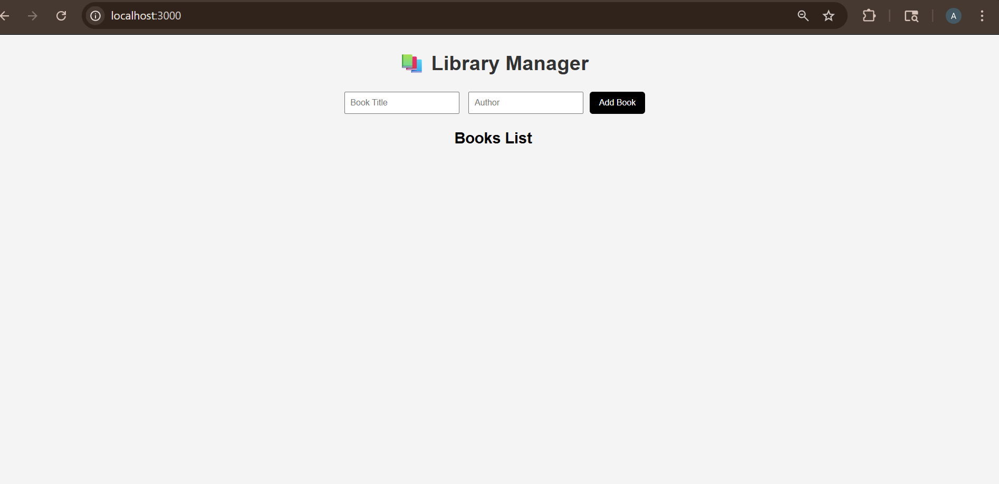
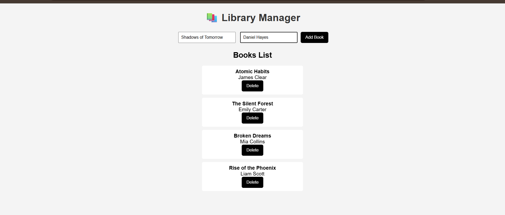
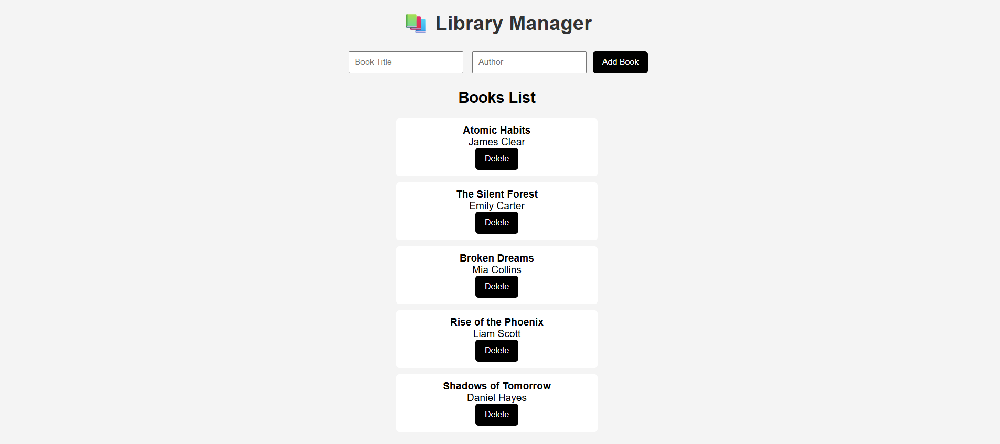
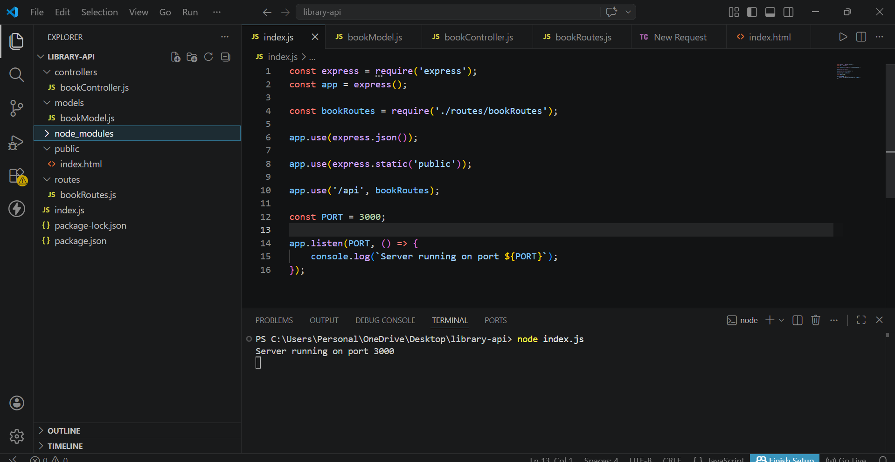
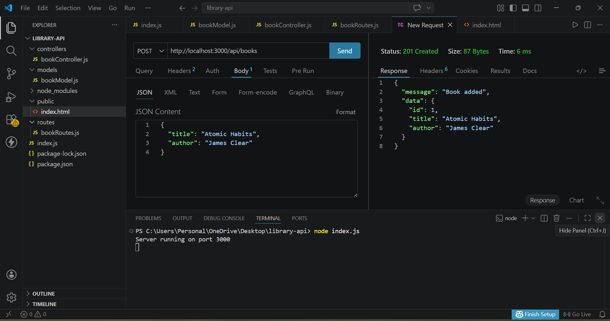

# Creative Library REST API

This project is a RESTful Library Management API built using Node.js and Express, with full CRUD functionality and a frontend interface. It is also deployed and accessible online.

## Live Demo

https://library-api-m87a.onrender.com

## Features

* Add books
* View books
* Update books
* Delete books

## Tech Stack

* Node.js
* Express.js

## Project Structure

controllers/ → Business logic
routes/ → API endpoints
models/ → Data structure
public/ → Frontend UI

## How to Run

1. npm install
2. node index.js
3. Open http://localhost:3000

## API Endpoints

GET /api/books
POST /api/books
PUT /api/books/:id
DELETE /api/books/:id

## Example

{
"title": "Atomic Habits",
"author": "James Clear"
}

## Screenshots

### UI

### Add Book

### Book List

### Project Structure

### API Testing (Thunder Client)

